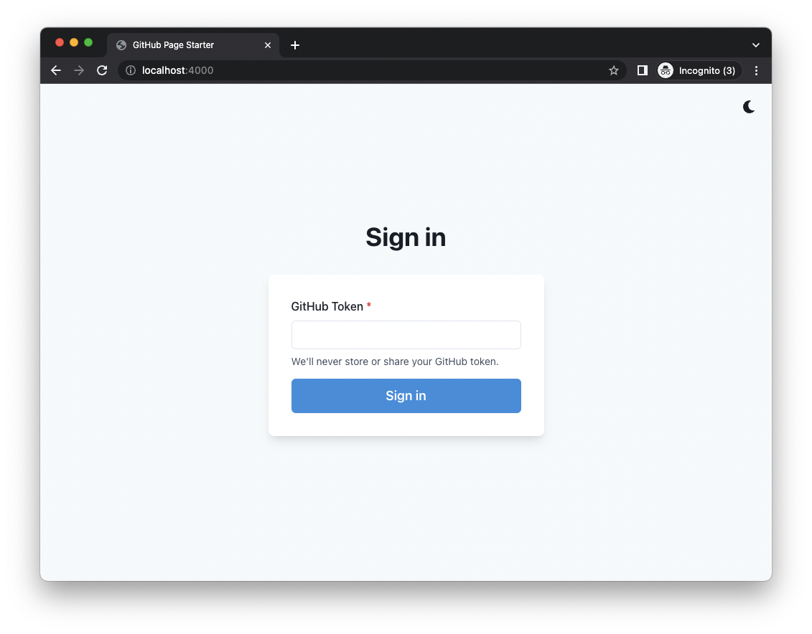
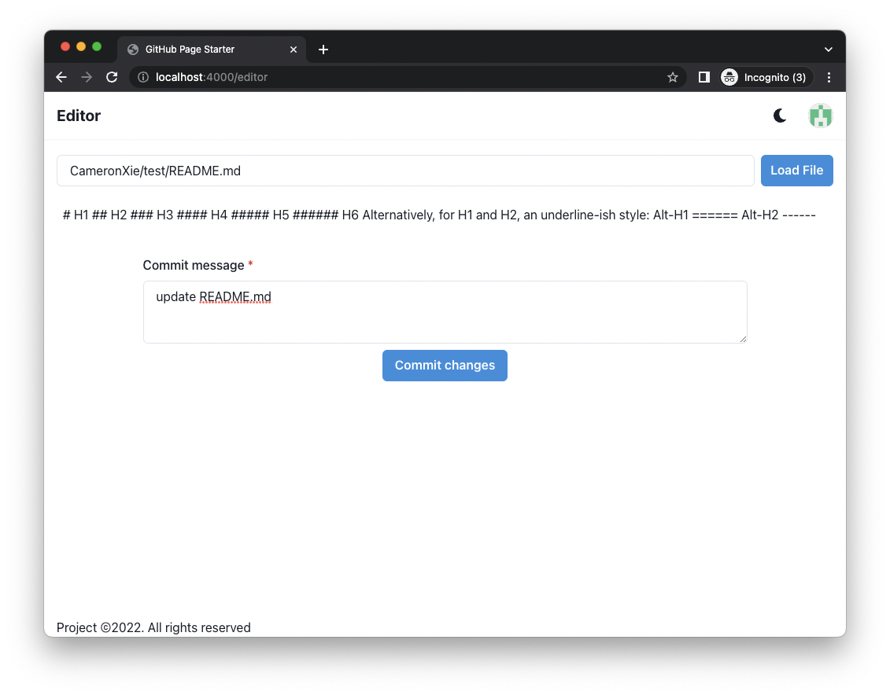

# GitHub Page Starter

A GitHub file editor by using GitHub page starter.

## Page

## Local Setup

Simply run `make start` from the project `root` directory to spin up a docker container to host the page. The page can
be accessed from `http://localhost:4000`
