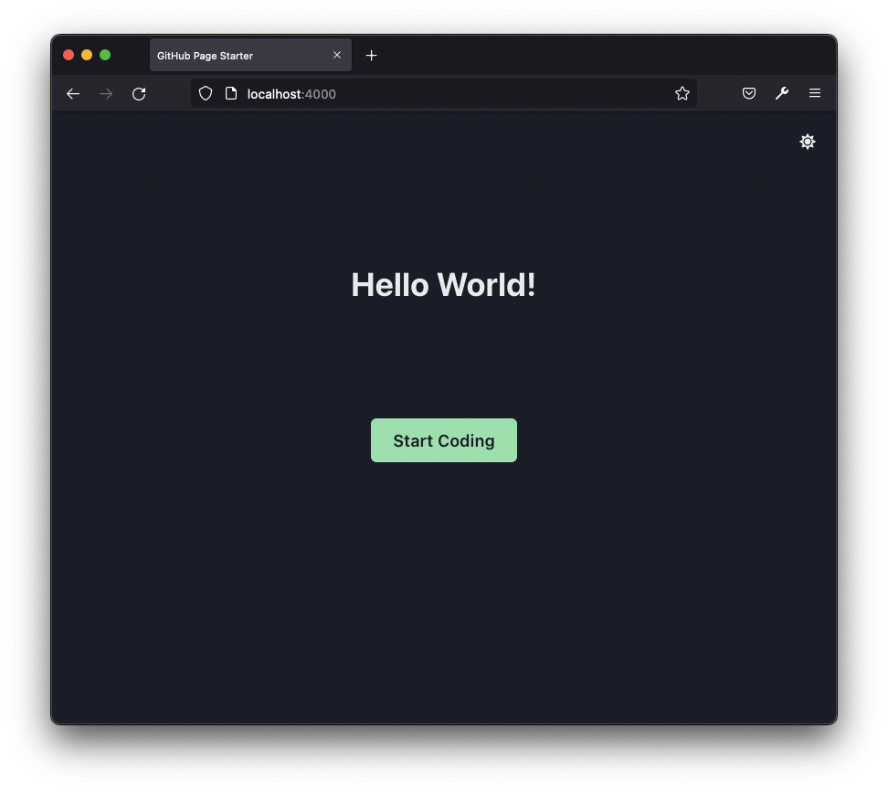

# GitHub Page Starter

This sample project demonstrate a possible solution to build GitHub page with Jekyll and ReactJS.

## Page

## Local Setup

Simply run `make start` from the project `root` directory to spin up a docker container to host the page. The page can
be accessed from `http://localhost:4000`
